# SuperBeastsAI Nodes

This repository contains custom nodes for ComfyUI created and used by SuperBeasts.AI (@SuperBeasts.AI on Instagram)

## Updates
- 19/07/25: Super Pop Colour Adjustment model and node release
- 31/07/24: Resolved bugs with dynamic input thanks to @Amorano. Add Github Action for Publishing to Comfy Registry thanks to @haohaocreates
- 30/07/24: Moved Deflicker & PixelDeflicker to Experimental labels (this will require readding them in your WF but I wanted this to be clearer)
- 30/04/24: 
- - Updated readme with documentation
- - Added Deflicker and PixelDeflicker nodes for reducing flickering artifacts in image sequences. 
- - Introduced CrossFadeImageBatches node for smooth cross-fade transitions between image batches
- - Enhanced ImageBatchManagement and MaskBatchManagement nodes with resizing, cropping, and reordering capabilities
- 27/03/24: Released and also pushed an update to resolve batched images for videos etc

---
# Super Beasts Custom Models (and nodes)


## Super Pop Color Adjustment (SuperBeasts.AI)

### Why “Super Pop”?

Months of solo R&D, hundreds of hand-tuned colour-grade examples and a brand-new residual
CNN culminated in a node that gives every image the **SuperBeasts “pop”** in
one click. No LUT-hunting, no 37-slider wrestling – just feed in your art and let the model
do the heavy lifting. I personally curated and corrected every training frame to lock down
the vibrant palette, deep blacks and crisp highlights that define my style.

> **Why I built it**  
> Every piece I create ends up in post-processing: lifting blacks, pulling
> whites, bending colour curves for that punchy HDR look. Auto tools in other applicatiosn were just not hitting the mark. 
> Using AI generators I loved the creative range, but found the that for tools such as ChatGPT the results could lean towards 
> muted yellow-brown tones where you would expect white and these often get worse over iterations. 
> Training a model to apply my signature grade automatically felt like the perfect way to learn more about AI models and also to reclaim that time — and
> share the benefits with everyone else. So enjoy Super Pop Colour Adjustments!

<table width="100%">
  <tr>
    <td style="width:25%" width="25%">Original</td>
    <td style="width:25%" width="25%">SPCA</td>
    <td style="width:25%" width="25%">Original</td>
    <td style="width:25%" width="25%">SPCA</td>
  </tr>
  <tr>
    <td></td>
    <td>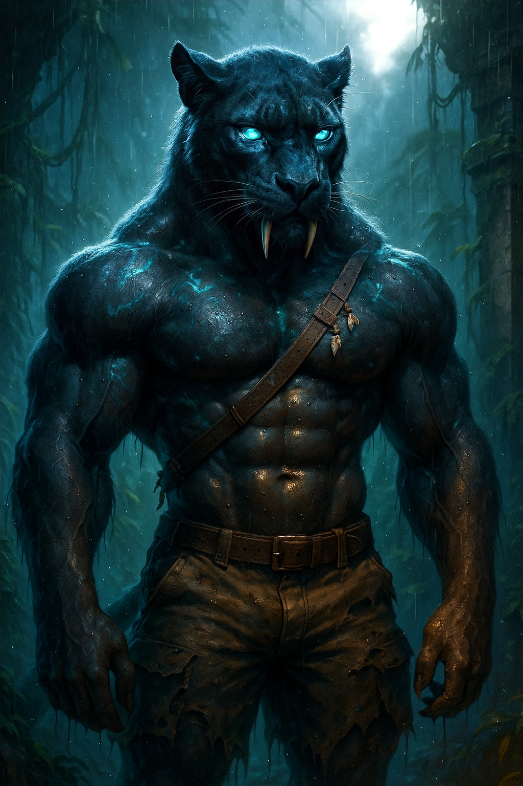</td>
    <td></td>
    <td>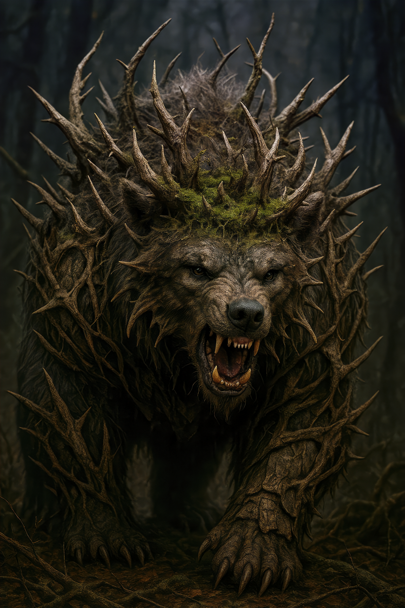</td>
  </tr>
  <tr>
    <td></td>
    <td>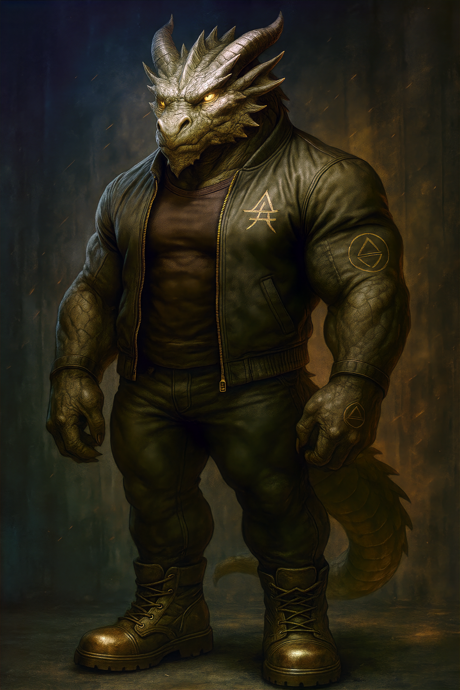</td>
    <td></td>
    <td></td>
  </tr>
  <tr>
    <td></td>
    <td>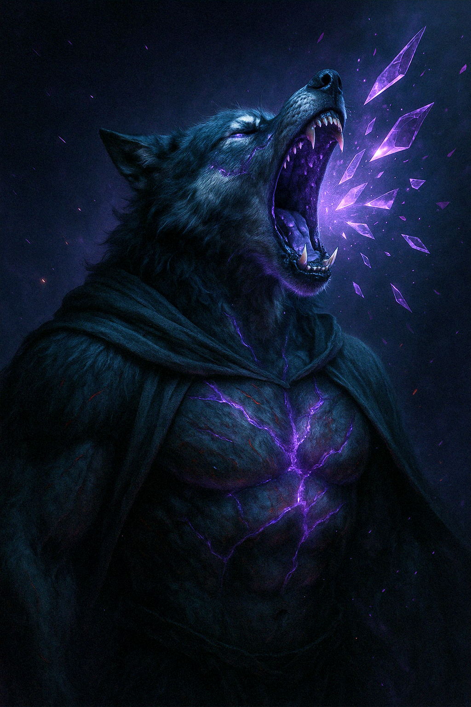</td>
    <td></td>
    <td>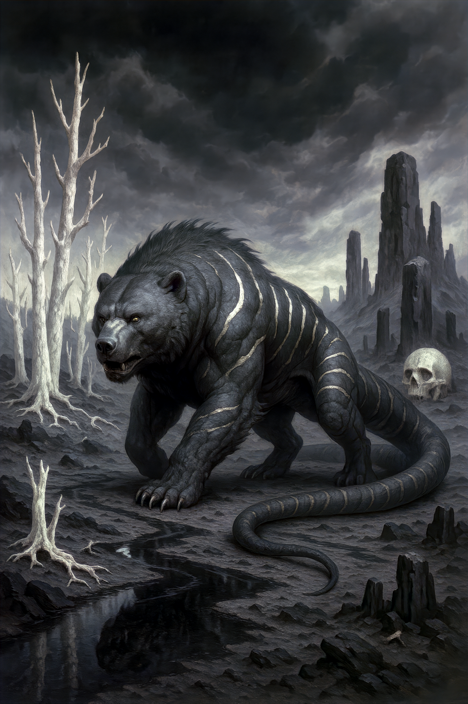</td>
  </tr>

  <tr>
    <td></td>
    <td>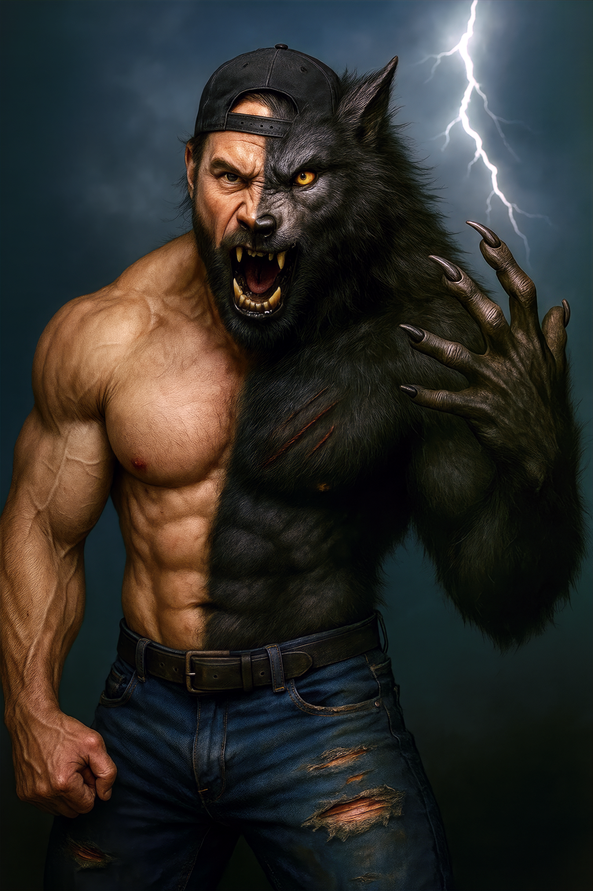</td>
    <td></td>
    <td></td>
  </tr>

  <tr>
    <td></td>
    <td></td>
    <td>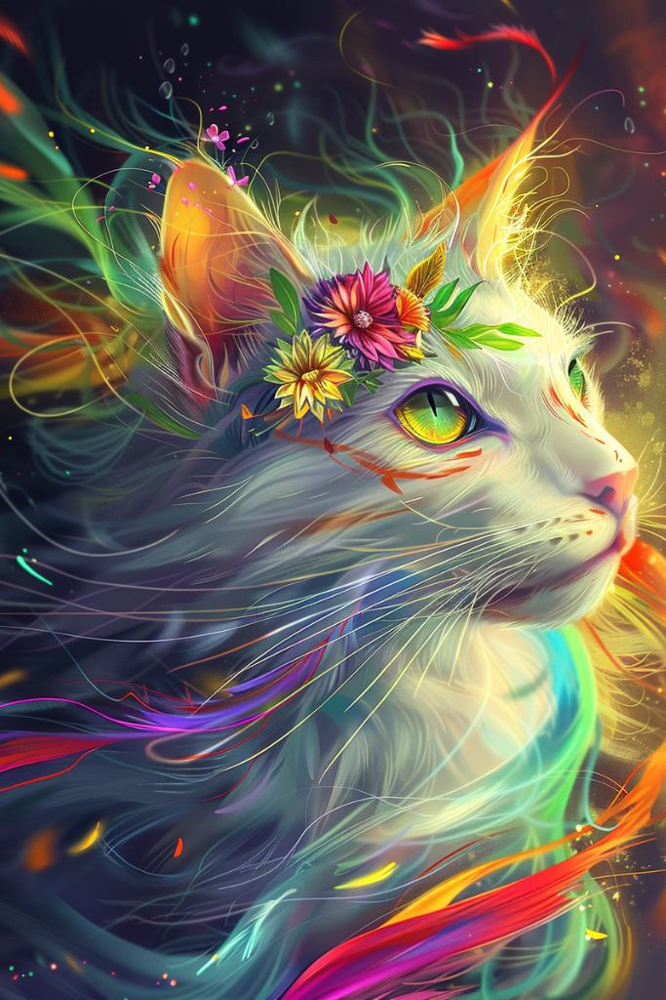</td>
    <td></td>
  </tr>

  <tr>
    <td></td>
    <td></td>
    <td></td>
    <td></td>
  </tr>

  <tr>
    <td></td>
    <td></td>
    <td></td>
    <td></td>
  </tr>

  <tr>
    <td></td>
    <td></td>
    <td></td>
    <td>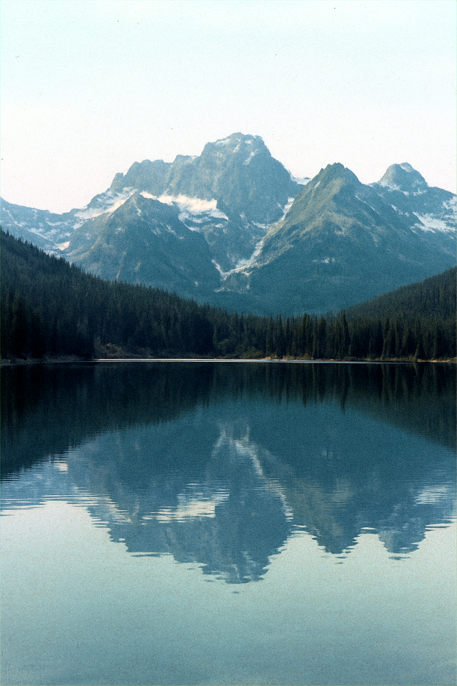</td>
  </tr>

  <tr>
    <td></td>
    <td>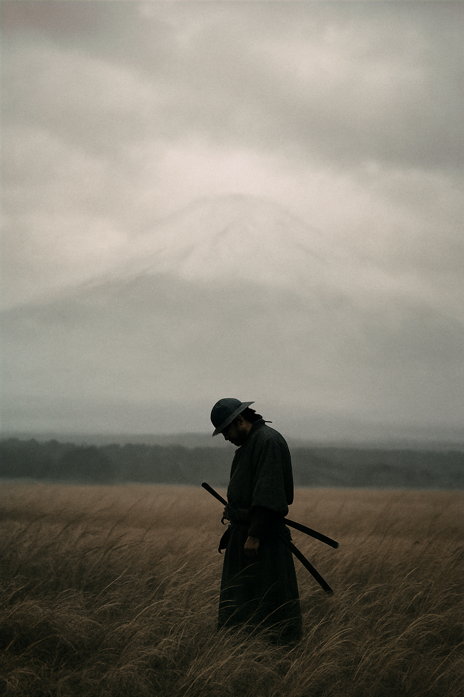</td>
    <td></td>
    <td>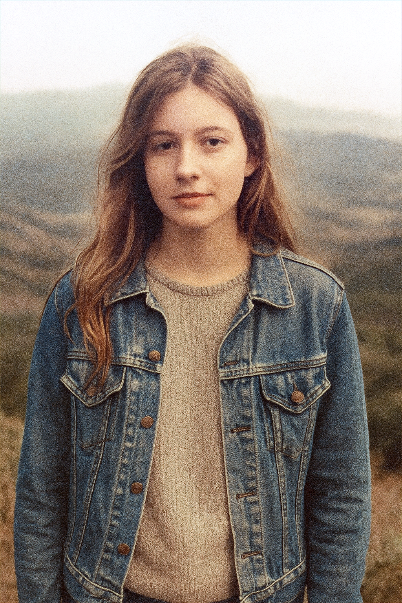</td>
  </tr>

  <tr>
    <td></td>
    <td>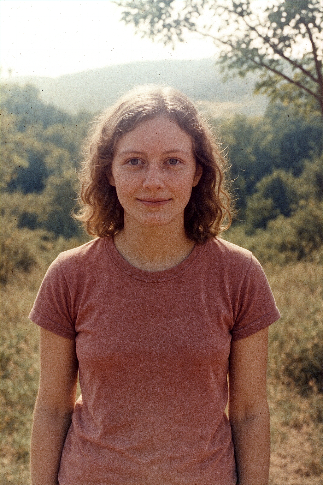</td>
    <td></td>
    <td>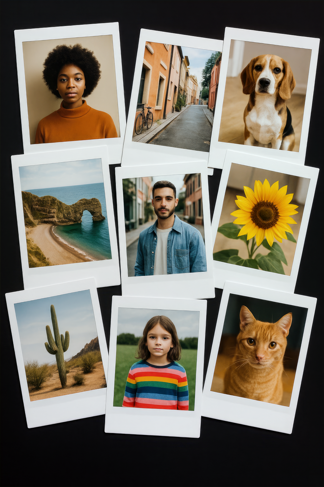</td>
  </tr>
  <tr>

  </tr>
</table>


### How it works

1. **SB Load Model** node loads the ONNX-formatted colour-adjustment network
    (`models/SuperBeasts_ColorAdjustment_512px_V1.onnx`).
2. The model analyses the image in 512 × 512 patches, predicting a residual colour grade.
3. Patches are seamlessly stitched back with configurable **strength**, **count** (variant
    batching) and **overlap** for large-resolution output.
4. A 64 × 64 **context** thumbnail guides the global colour mapping – leave it empty for
    natural results or experiment with creative transfers.

### Recommended quick-start

| Parameter | Suggested | Notes |
|-----------|-----------|-------|
| Strength  | **1.0**   | 0.5-2.0 for subtle ➜ dramatic |
| Count     | 1         | Increase for automatic variant batching |
| Overlap   | 0.9       | Lower if GPU memory is tight |
| Initial context for batch | False | True (Experimental - may be useful for tone-locked video frames) |

### Known limitations / quirks

* **Patch size sensitivity:** The network works on 512 px tiles – with images above ~2 K you may
  notice slight local exposure shifts.  Pushing *Overlap* up to 0.8-0.9 blends these out at the
  cost of extra compute.
* **Atmospheric overlays:** Because the model corrects blacks / whites aggressively it can
  dial back matte-style colour washes or cinematic tints.  Keep *Strength* around 0.7 or blend
  the result back with the original if you want to retain the mood.
* **Very high strengths:** Values above 2.0 can clip highlights or oversaturate; use sparingly
  for stylised effects.

### Creative workflow ideas

1. **HDR Sandwich** – Run Super Pop, then feed the output into **HDR Effects** (with gentle
   settings) to amplify micro-contrast.
2. **Subtle polish** – Blend Super Pop result back with the original at 30-50 % opacity using a
   ComfyUI Mix or Composite node.
3. **Colour remap** – Plug a palette or reference frame into the *Context* input to nudge the
   final toning toward that colour space.
4. **Video consistency** – Enable *Initial context for batch* to subtely lock colour across frames (still experimental).

### Understanding the *Context* input

The context socket takes a **64 × 64** image that acts as a colour-map reference while the
network predicts its residual.  If you leave it unplugged the node automatically downsamples
your source image – this mirrors how the model was trained and is the safest default.

When might you override it?

* **Palette steer** – pass in a small palette swatch or another artwork to pull the grade towards what would likely be the **correction** 
  those hues and levels.
* **Shot matching** – feed a hero frame from earlier in a sequence to keep later frames corrections more tonally consistent.
* **Creative grading** – drop in a totally different style image (e.g.
a sunset or neon sign) for experimental colour correction shifts.

Remember: the context influences *global* colour balance, not fine detail, so even heavily
down-scaled or abstract images work great but this only plays a small role in the final correction - ultimatley the actual 512x512px patch being corrected has the greated weight in the adjustment task. 

### System Requirements

Works out-of-the-box on CPU via `onnxruntime`.  For **10-30×** faster inference install the
GPU build – ComfyUI will automatically select the `CUDAExecutionProvider` (or DirectML on
Windows).

```powershell
pip install onnxruntime-gpu      # NVIDIA CUDA
#-or-
pip install onnxruntime-directml # AMD/Intel (Windows)
```

### Licensing & weight downloads

This model is released under the **SPCA-RAIL licence**.  Full text lives in the model repository:
<https://github.com/SuperBeastsAI/SuperBeastsAI-Models/blob/main/SuperPopColorAdjustment/LICENSE_SUPERPOP.txt>
• Free for personal & commercial *output* use.  
• Redistribution / hosting of the weights is **not** allowed without permission.

Weights are automatically downloaded the first time the **SB Load Model** node runs.  If you
prefer manual download, grab them from the GitHub release page:

`https://github.com/SuperBeastsAI/SuperBeastsAI-Models/tree/main/SuperPopColorAdjustment/downloads/`  
and drop the `.onnx` file into `custom_nodes/ComfyUI-SuperBeasts/models/`.

---

# Image Effects

## HDR Effects (SuperBeasts.AI)

The HDR Effects is an image processing application that enhances the dynamic range and visual appeal of input images. It provides a set of adjustable parameters to fine-tune the HDR effect according to user preferences.

### Features

- Adjusts the intensity of shadows, highlights, and overall HDR effect
- Applies gamma correction to control the overall brightness and contrast
- Enhances contrast and color saturation for more vibrant results
- Preserves color accuracy by processing the image in the LAB color space
- Utilizes luminance-based masks for targeted adjustments
- Blends the adjusted luminance with the original luminance for a balanced effect

## Examples


### Parameter details

The application provides the following adjustable parameters:

- `hdr_intensity` (default: 0.5, range: 0.0 to 5.0, step: 0.01):
  - Controls the overall intensity of the HDR effect
  - Higher values result in a more pronounced HDR effect

- `shadow_intensity` (default: 0.25, range: 0.0 to 1.0, step: 0.01):
  - Adjusts the intensity of shadows in the image
  - Higher values darken the shadows and increase contrast

- `highlight_intensity` (default: 0.75, range: 0.0 to 1.0, step: 0.01):
  - Adjusts the intensity of highlights in the image
  - Higher values brighten the highlights and increase contrast

- `gamma_intensity` (default: 0.25, range: 0.0 to 1.0, step: 0.01):
  - Controls the gamma correction applied to the image
  - Higher values increase the overall brightness and contrast

- `contrast` (default: 0.1, range: 0.0 to 1.0, step: 0.01):
  - Enhances the contrast of the image
  - Higher values result in more pronounced contrast

- `enhance_color` (default: 0.25, range: 0.0 to 1.0, step: 0.01):
  - Enhances the color saturation of the image
  - Higher values result in more vibrant colors
 
---

# Image & Mask Batch Management

Keep your image and masks sized, cropped and ordered how ever you like without having to recreate the masks or mess with connections. 
Note the resizing capability doesn't provide any settings, we simply crop and resize to maximise the image size with your provided width/height. 


## ImageBatchManagement

The ImageBatchManagement node provides functionality to resize, crop, and reorder a batch of images. It ensures that all images in the batch have the same specified dimensions.

### Features
- Resizes and crops images to the specified width and height
- Allows reordering the images in the batch based on a provided order
- Supports unlimited input images

## MaskBatchManagement

The MaskBatchManagement node is similar to the ImageBatchManagement node but works with mask inputs. It resizes, crops, and reorders a batch of masks to match the specified dimensions.

### Features
- Resizes and crops masks to the specified width and height
- Allows reordering the masks in the batch based on a provided order
- Supports unlimited input masks


# Deprecated / Removed

## Deflicker & PixelDeflicker

The Deflicker nodes have been marked as "Experimental" as they were experiments that were released but not really fit for purpose / doing what you would expect of a deflicker node. 
At some point I will be removing these nodes as I won't be supporting them at this stage.  

## MakeResizedMaskBatch (Deprecated please use MaskBatchManagement)
The MakeResizedMaskBatch node creates a batch of masks from multiple individual masks or batches. 
It resizes and crops the input masks to match the specified width and height.

## Cross Fade Image Batches (SuperBeasts.AI)
There is another preexisting node that does this and more so I've removed this function.

